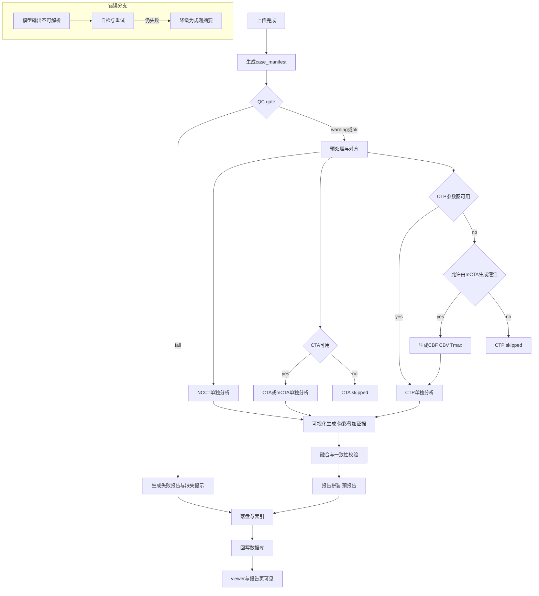

# 卒中智能体端到端可落地流程与架构设计稿（Medgemma 1.5 统一单独分析，可插拔替换）

本设计稿以“不破坏现有功能，能在现有代码库落地”为目标，基于既有能力梳理与方案文档：[`docs/CORE_FUNCTIONS.md`](docs/CORE_FUNCTIONS.md) 、[`plans/STROKE_AGENT_PROPOSAL.md`](plans/STROKE_AGENT_PROPOSAL.md) 、[`plans/STROKE_AGENT_RND_REQUIREMENTS.md`](plans/STROKE_AGENT_RND_REQUIREMENTS.md)。

新增能力：NCCT 单独分析、CTA/mCTA 单独分析、CTP 单独分析、多模态汇总报告。

当前阶段统一使用本地部署开源医学模型 Medgemma 1.5（读片能力一般）作为“文本/结构化结论生成器”，并用规则与传统算法负责“强约束、可解释、可量化”的部分；设计模型适配层确保未来替换为自研模型不改上层编排与前端展示协议。

---

## 0. 设计目标与基本原则

### 0.1 设计目标

- NCCT 必选，支持多种输入组合自动分流，并有质量差/缺失数据的可解释降级路径。
- 每条工作流输出“证据→结论→不确定性/建议”的临床可用格式，且结构化结果可被前端 viewer 与报告页直接消费。
- 产物落盘可追溯（时间戳、版本、审计字段），并可回写 Supabase/索引。
- 运行方式兼容同步与异步；P0 先同步落地，后续可无缝引入队列。

### 0.2 基本原则（Medgemma 用法边界）

- Medgemma 负责：
  - 从“可解释的证据摘要”中生成结构化结论与报告文本片段（严格 JSON 或严格 Markdown 段落）。
  - 对规则输出进行语言化总结与风险提示。
- 规则/传统算法必须负责：
  - 体积/阈值计算、像素级掩膜/叠加图生成、单位校验、跨模态一致性检查、QC。
- 人机可编辑：
  - 报告段落最终在 Web 端可编辑；结构化 JSON 保留原始自动结果与人工修订痕迹。

---

## 1. 系统支持的输入组合与自动分流策略

### 1.1 输入组合（NCCT 必选）

支持如下组合（CTA/CTP 可选）：

- W1：NCCT-only
- W2：NCCT + single-phase CTA（动脉期或单期 CTA）
- W3：NCCT + mCTA（三期：动脉/静脉/延迟）
- W4：NCCT + CTA + CTP（CTP 可为参数图输入，或由系统生成）

### 1.2 自动分流策略（detector + qc gate + fallback）

**Step A：输入识别**

- 在上传完成后生成 `case_manifest`，判定 `available_modalities`：
  - `ncct`（必有）
  - `cta_single`（有单期 CTA）
  - `mcta`（动脉+静脉+延迟三期齐）
  - `ctp_maps`（有外部参数图，如 CBF/CBV/Tmax）
  - `perfusion_ai`（可由本系统生成的 CBF/CBV/Tmax 产物可用）

**Step B：QC Gate**

- QC 输出 `qc_level`：`ok | warning | fail`。
- `fail`：只允许生成“缺失/质量差提示报告”，不输出关键诊断性结论。
- `warning`：允许输出结论但强制降低置信度，并在报告中提示需人工复核。

**Step C：工作流选择**

- 始终运行：NCCT 单独分析（因为 NCCT 必选）。
- 运行 CTA 分析：当 `cta_single` 或 `mcta` 可用。
- 运行 CTP 分析：
  - 优先使用 `ctp_maps`（外部参数图）。
  - 若无 `ctp_maps` 且 `mcta` 可用且允许生成：触发现有灌注图生成链路（复用 [`class MultiModelAISystem`](ai_inference.py:22)）产出 CBF/CBV/Tmax，再运行病灶量化（复用/扩展 [`class StrokeAnalysis`](stroke_analysis.py:16)）。

**Step D：降级路径**

- CTA 缺失：CTA 模块状态为 `skipped`，在 viewer 与报告中生成缺失提示文案。
- CTP 缺失：CTP 模块状态为 `skipped`；若仅 NCCT+CTA，输出“无灌注量化依据”的措辞。
- 配准失败：融合模块降级为“并列呈现证据，不做跨模态一致性推断”，并输出冲突卡。

---

## 2. 端到端阶段划分与触发条件（所有工作流统一状态机）

### 2.1 阶段列表（Stage）

统一 Stage 枚举：

1. `UPLOAD_DONE`：上传完成，生成 `case_manifest`
2. `PREPROCESS_DONE`：预处理完成（切片、重采样、方向统一、必要的配准准备）
3. `PERFUSION_READY`：灌注参数图可用（外部输入或系统生成）
4. `VISUALS_READY`：伪彩/叠加图/关键证据图生成完成
5. `ANALYSIS_NCCT_DONE`：NCCT 单独分析完成
6. `ANALYSIS_CTA_DONE`：CTA/mCTA 单独分析完成（可跳过）
7. `ANALYSIS_CTP_DONE`：CTP 单独分析完成（可跳过）
8. `FUSION_DONE`：多模态一致性校验与冲突卡完成
9. `REPORT_DRAFT_DONE`：预报告拼装完成（模块段落+证据引用）
10. `DB_SYNC_DONE`：回写 Supabase/索引完成

### 2.2 触发条件

- 上传完成触发：`POST /api/agent/run` 或在上传成功后自动触发。
- `PREPROCESS_DONE` 触发条件：至少 NCCT 成功读取并完成基础 QC。
- `PERFUSION_READY` 触发条件：
  - 有 `ctp_maps` 或
  - 允许调用灌注生成链路且 `mcta` 可用。
- `VISUALS_READY` 触发条件：存在可展示的图像（至少 NCCT slice png）；若 `PERFUSION_READY` 则补齐伪彩/叠加。

---

## 3. 数据流与控制流编排（Mermaid：任务编排 + 状态机 + 错误分支）



---

## 4. 产物落盘目录规范与命名约定（与现有处理目录兼容）

以 `static/processed/<file_id>/` 为病例根目录，兼容现有病灶分析路径风格（参考 [`analyze_stroke_case()`](stroke_analysis.py:374)）。新增规范如下：

```text
static/processed/<file_id>/
  inputs/
    manifest_inputs.json
    ncct.nii.gz
    cta_single.nii.gz
    mcta_arterial.nii.gz
    mcta_venous.nii.gz
    mcta_delayed.nii.gz
    ctp_maps/
      cbf.nii.gz
      cbv.nii.gz
      tmax.nii.gz
  preprocess/
    ncct_resampled.nii.gz
    cta_resampled.nii.gz
    registration/
      reg_matrix.json
      reg_qc.json
  perfusion/
    generated/
      slice_000_cbf_output.npy
      slice_000_cbf.png
      slice_000_tmax_output.npy
      slice_000_tmax.png
    external/
      cbf_map.nii.gz
      cbv_map.nii.gz
      tmax_map.nii.gz
  visuals/
    pseudocolor/
      slice_000_cbf_pseudocolor.png
      slice_000_tmax_pseudocolor.png
    overlays/
      slice_000_penumbra_overlay.png
      slice_000_core_overlay.png
      slice_000_combined_overlay.png
    key_slices/
      ncct_key_slice_012.png
      cta_key_slice_034.png
  module_results/
    ncct_v1.json
    cta_v1.json
    ctp_v1.json
    fusion_v1.json
  report/
    report_draft_v1.md
    report_final_v1.md
  audit/
    job_v1.json
    runtime.log
    errors.jsonl
```

命名约定：

- JSON 文件名包含版本：`<module>_v<schema_version>.json`
- Markdown 包含版本：`report_draft_v<schema_version>.md`
- 证据图片包含 slice 编号与模态

---

## 5. 各模块输出边界（证据→结论→不确定性/建议）与结构化 JSON Schema

### 5.1 统一 JSON Schema（所有模块通用 envelope）

所有模块结果文件（NCCT/CTA/CTP/FUSION）遵循统一 envelope：

```json
{
  "schema_version": "1.0.0",
  "module": "ncct|cta|ctp|fusion",
  "file_id": "<string>",
  "patient_id": "<int or string>",
  "job_id": "<string>",
  "idempotency_key": "<string>",
  "timestamp_utc": "<iso8601>",
  "inputs": {
    "modalities": ["ncct", "cta_single", "mcta", "ctp_maps", "perfusion_ai"],
    "files": [{"role": "ncct", "path": "...", "sha256": "..."}]
  },
  "qc": {
    "level": "ok|warning|fail",
    "warnings": [{"code": "QC_*", "message": "..."}],
    "fatal": [{"code": "QC_FATAL_*", "message": "..."}]
  },
  "evidence": [
    {
      "type": "image|text|metric",
      "title": "...",
      "path": "visuals/...png",
      "slice_index": 12,
      "notes": "..."
    }
  ],
  "findings": [
    {
      "id": "F001",
      "category": "hemorrhage|ischemia|lvo|collateral|perfusion|other",
      "evidence_refs": ["E001", "E002"],
      "conclusion": "positive|negative|indeterminate",
      "confidence": {"value": 0.0, "calibration": "rule|model|hybrid"},
      "uncertainty": {
        "level": "low|medium|high",
        "reasons": [{"code": "UNC_*", "message": "..."}]
      },
      "recommendations": [
        {"type": "manual_review|acquire_cta|acquire_ctp|consider_thrombectomy|other", "message": "..."}
      ],
      "structured": {}
    }
  ],
  "numerics": {
    "units": "ml|ratio|s",
    "values": [{"name": "core_volume_ml", "value": 0.0, "unit": "ml", "basis": "tmax>6s"}]
  },
  "rules_and_thresholds": [
    {"name": "defuse3", "details": "mismatch>=1.8 and mismatch_volume>=15ml"}
  ],
  "model": {
    "engine": "medgemma-1.5",
    "adapter_version": "1.0.0",
    "prompt_version": "ncct.v1",
    "raw_output_path": "audit/medgemma_raw.json",
    "parse_status": "ok|repaired|failed"
  },
  "status": {
    "state": "done|skipped|failed",
    "error": {"code": "ERR_*", "message": "...", "retryable": false}
  },
  "audit": {
    "operator": "system|user",
    "request_ip": "...",
    "user_agent": "...",
    "trace_id": "..."
  }
}
```

约束：

- `schema_version` 固定为语义化版本；每次变更必须保留向后兼容读取逻辑。
- `confidence.value` 必须为 `0.0~1.0`；若未知，使用 `0.0` 且 `uncertainty.level=high`。
- 任何失败必须填充 `status.error.code`。

### 5.2 NCCT 单独分析模块（输出边界）

**证据（必须）**

- 关键切片截图：至少 1 张 `visuals/key_slices/ncct_key_slice_*.png`
- QC 结果：强制输出

**结构化结论（必须）**

- 出血排除：`positive|negative|indeterminate`
- 早期缺血征象提示：`positive|negative|indeterminate`

**不确定性与建议（必须）**

- 若 QC 为 `warning|fail`，强制给出 `manual_review` 建议。
- 若缺血征象不确定，建议补充 CTA/CTP。

### 5.3 CTA 或 mCTA 单独分析模块（输出边界）

**证据（必须）**

- 关键切片/投影证据图：至少 1 张 `visuals/key_slices/cta_key_slice_*.png`

**结构化结论（必须）**

- LVO 疑似：`positive|negative|indeterminate`
- 闭塞段：如 `ICA-T|M1|M2|BA|P1|unknown`
- 侧支评分：mCTA 才输出完整评分；single CTA 输出 `limited` 并提高不确定性。

### 5.4 CTP 单独分析模块（输出边界）

**证据（必须）**

- 伪彩图：至少一张 `visuals/pseudocolor/...png`（若灌注可用）
- 叠加图：半暗带/核心/综合各至少 1 张（可复用现有病灶可视化思想）

**结构化结论（必须）**

- `core_volume_ml`、`penumbra_volume_ml`、`mismatch_ratio`
- DEFUSE3 提示：`eligible_hint|not_eligible_hint|indeterminate`

**阈值依据（必须）**

- 必须写入 `rules_and_thresholds` 并在 `numerics.values[].basis` 标注

---

## 6. Markdown 报告段落模板生成规范（可拼装、可编辑、可固化）

### 6.1 报告拼装策略

- 每个模块产出一个 `report_fragment_<module>.md`（可选），融合层负责按固定顺序拼装：
  1) 检查方法
  2) NCCT 表现
  3) CTA/mCTA 血管评估（若有）
  4) 灌注与量化（若有）
  5) 结论与建议（包含不确定性与复核建议）
  6) 证据索引（图片链接/切片索引）

### 6.2 段落模板（示例规范）

约束：

- 每段落必须包含：结论句 + 证据引用 + 不确定性提示（若有）
- 对缺失模态必须输出固定句式

示例（NCCT 段落模板）

```md
## NCCT影像表现
- 结论: {hemorrhage_ruleout_text}; {early_ischemia_text}
- 证据: {ncct_key_slice_list}
- 不确定性: {uncertainty_text}
```

示例（缺失 CTP 模态）

```md
## 灌注与量化
- 未提供CTP参数图，且当前数据条件不足以生成可靠灌注量化结果。本部分结论不输出。
```

---

## 7. Medgemma 1.5 职责边界与调用策略（提示词、结构约束、自检纠错、后处理）

### 7.1 统一“证据摘要输入”规范（避免把大体积图像直接喂给模型）

Medgemma 的输入不直接传 NIfTI 全量数据；统一由上游模块生成“证据摘要包”再调用模型：

- 关键数值：体积、比值、阈值依据、QC 等
- 关键截图：选择 1~6 张代表性切片（以 PNG Base64 或文件路径引用，依据部署方式）
- 结构化上下文：患者年龄、NIHSS、发病到入院时间（若有）

### 7.2 Medgemma 输出约束：严格 JSON

对 Medgemma 的输出强制：

- `response_format = strict_json`（若通过 adapter 实现）
- 顶层必须包含：`findings[]` 与每条 finding 的 `conclusion/confidence/uncertainty/recommendations/structured`
- 禁止输出额外解释文字

### 7.3 提示词策略（模块化 Prompt，注册与版本化）

> 所有 prompt 通过 PromptRegistry 注册，prompt 版本号写入结果 JSON 的 `model.prompt_version`。

#### 7.3.1 NCCT prompt（ncct.v1）

输入：QC 摘要 + 关键切片描述（或图片）+ 规则检测提示（如高密度区候选）。

输出 JSON 目标字段：

- `hemorrhage_ruleout`: `positive|negative|indeterminate`
- `early_ischemic_signs`: `positive|negative|indeterminate`
- `hyperdense_mca_sign`: `positive|negative|indeterminate`
- `aspects_estimate`: `0-10|indeterminate`
- `confidence`: 0~1
- `uncertainty_reasons[]`

#### 7.3.2 CTA/mCTA prompt（cta.v1）

输入：血管显影 QC + 对侧差异摘要 + 关键证据图摘要。

输出 JSON 目标字段：

- `lvo_suspect`
- `occlusion_site`
- `collateral_score`（mCTA 完整，CTA 限制）
- `confidence`

#### 7.3.3 CTP prompt（ctp.v1）

输入：规则计算出的体积/比值 + 阈值依据 + 关键叠加图摘要。

输出 JSON 目标字段：

- `core_volume_ml`、`penumbra_volume_ml`、`mismatch_ratio`
- `defuse3_eligibility_hint`
- `confidence` 与 `uncertainty_reasons`

### 7.4 自检与纠错重试策略（必须工程化）

当 Medgemma 输出不可解析或缺字段：

1. `parse`：严格 JSON parse
2. `validate`：字段级校验（必填字段是否存在、枚举是否合法、数值范围）
3. `repair`：发送“纠错 prompt”，只允许返回修复后的 JSON
4. `retry`：最多 2 次；仍失败则降级：
   - 使用规则/传统算法的“最小结论集”填充 findings
   - `model.parse_status = failed`，并在 `status.error` 中记录

### 7.5 后处理与一致性校验规则（跨模态、单位、阈值、矛盾检测）

统一后处理引擎做：

- 单位与范围：ml 体积必须 `>=0`，比值必须 `>=0`，异常则标记 `UNC_UNIT_RANGE` 并降级。
- 阈值依据一致性：若 `numerics.values[].basis` 缺失，补齐默认规则并标记 `UNC_BASIS_MISSING`。
- 冲突检测：
  - CTA 指示右侧 LVO，但 CTP 缺损侧为左侧 → `conflict_side`
  - NCCT 提示明显大面积缺血，但核心体积为 0 且 QC ok → `conflict_ncct_ctp`
- 降级措辞：冲突存在时，结论改为 `indeterminate`，并强制添加 `manual_review`。

---

## 8. 模型适配层与可插拔接口（未来替换自研模型不改上层）

### 8.1 抽象接口（建议形态）

- `ModelClient`
  - `infer(prompt_id, payload, response_schema) -> raw_output`
- `PromptRegistry`
  - `get(prompt_id, version) -> prompt_template`
- `Analyzer`
  - `run(file_id, inputs, qc, artifacts) -> module_result_envelope`

### 8.2 版本管理与回滚

- adapter 版本写入 `model.adapter_version`
- prompt 版本写入 `model.prompt_version`
- 支持 A/B：在 `case_manifest` 中记录 `model_variant`
- 支持回滚：读取旧版本 JSON 仍能被 viewer 与报告拼装器消费（兼容字段映射表）

### 8.3 离线回放评测入口（工程化要求）

- 输入：历史 `inputs/manifest_inputs.json` + `module_results/*.json`
- 输出：一致性校验报告 + 解析成功率 + 缺字段统计
- 用于 Medgemma 与未来自研模型的对比

---

## 9. 后端 API 设计（路由、请求/响应体、幂等、任务ID、轮询、鉴权审计）

### 9.1 设计约束

- 保持现有页面路由不变：上传与 viewer 入口仍由现有 Flask 路由提供（参见 [`upload_files()`](app.py:2803) 与 [`viewer_page()`](app.py:2798)）。
- 新增 API 采用 `/api/agent/*` 命名空间。

### 9.2 `POST /api/agent/run`

用途：对指定 `file_id` 启动一次“按可用模态自动运行”的编排任务。

请求体：

```json
{
  "file_id": "...",
  "patient_id": 123,
  "idempotency_key": "<uuid>",
  "options": {
    "prefer_external_ctp": true,
    "allow_generate_perfusion": true,
    "generate_pseudocolor": true,
    "run_cta_analysis": true,
    "run_ctp_analysis": true,
    "timeout_seconds": 900
  },
  "audit": {
    "operator": "system|user",
    "request_ip": "...",
    "user_agent": "...",
    "trace_id": "..."
  }
}
```

响应体：

```json
{
  "success": true,
  "job_id": "job_<timestamp>_<rand>",
  "file_id": "...",
  "status": "queued|running|done|failed",
  "poll_url": "/api/agent/status?file_id=...&job_id=..."
}
```

幂等规则：

- `idempotency_key + file_id` 作为幂等键
- 若相同幂等键已完成，直接返回已存在的 `job_id` 与结果索引

### 9.3 `GET /api/agent/status`

请求参数：`file_id`、可选 `job_id`

响应体：

```json
{
  "success": true,
  "file_id": "...",
  "job_id": "...",
  "stage": "REPORT_DRAFT_DONE",
  "modules": {
    "ncct": "done",
    "cta": "skipped",
    "ctp": "running",
    "fusion": "pending",
    "report": "pending"
  },
  "progress": {"percent": 60},
  "last_error": {"code": "", "message": ""}
}
```

### 9.4 `GET /api/agent/result`

响应体（索引型，避免大文件直传）：

```json
{
  "success": true,
  "file_id": "...",
  "case_manifest_path": "static/processed/<file_id>/inputs/manifest_inputs.json",
  "module_results": {
    "ncct": "static/processed/<file_id>/module_results/ncct_v1.json",
    "cta": "static/processed/<file_id>/module_results/cta_v1.json",
    "ctp": "static/processed/<file_id>/module_results/ctp_v1.json",
    "fusion": "static/processed/<file_id>/module_results/fusion_v1.json"
  },
  "report": {
    "draft": "static/processed/<file_id>/report/report_draft_v1.md",
    "final": "static/processed/<file_id>/report/report_final_v1.md"
  },
  "visuals": {
    "key_slices": ["/get_image/<file_id>/..."],
    "overlays": ["/get_stroke_analysis_image/<file_id>/..."],
    "pseudocolor": ["/get_image/<file_id>/...pseudocolor.png"]
  }
}
```

### 9.5 鉴权与审计字段

- P0 可先复用现有 session 机制；但 API 必须写入 `audit.trace_id/operator/request_ip/user_agent`
- 对 Supabase 写入必须记录 `job_id` 与 `schema_version`

---

## 10. 推理与分析运行方式（同步/异步、资源、超时、重试、缓存复用）

### 10.1 同步与异步

- P0 同步：`POST /api/agent/run` 内直接执行，并在超时前返回 `done|failed`。
- P1 异步：引入 job queue（线程/进程/外部队列），`run` 立即返回 `job_id`，前端轮询 `status`。

### 10.2 GPU/CPU 资源策略

- 传统算法（QC、阈值、连通域）默认 CPU。
- 灌注生成（如多模型推理）优先 GPU；无 GPU 时可降级为跳过生成，并在报告标记缺失。
- Medgemma 若 GPU 可用则 GPU；否则 CPU 且提高超时阈值。

### 10.3 超时与重试

- 模块级 timeout：NCCT 120s、CTA 180s、CTP 240s、融合 60s、报告拼装 30s（可配置）。
- Medgemma 解析失败重试最多 2 次；重试会写入 `audit/errors.jsonl`。

### 10.4 缓存与复用

- 若 `module_results/<module>_v1.json` 已存在且输入 hash 未变，则跳过并复用
- 伪彩与叠加图同理

---

## 11. 与现有 viewer 与报告页对接（卡片字段、图片、缺失提示）

### 11.1 viewer 展示映射

现有 viewer 布局与交互基于模板与脚本：[`templates/patient/upload/viewer/index.html`](templates/patient/upload/viewer/index.html) 与 [`static/js/viewer.js`](static/js/viewer.js)。新增对接策略：

- 新增“智能体结果卡片区”（建议在 viewer 右侧或 analysis panel 内扩展）：
  - NCCT 卡：出血排除、早期缺血征象、ASPECTS（若 indeterminate 则显示为需复核）
  - CTA 卡：LVO、闭塞段、侧支评分
  - CTP 卡：核心/半暗带/不匹配、DEFUSE3 hint
  - 冲突卡：侧别冲突、体积冲突、QC 风险
- 每张卡片必须展示：
  - 结论（positive/negative/indeterminate 的中文化）
  - 证据图缩略图（点击打开原图）
  - 不确定性原因（高亮）

### 11.2 缺失模态提示文案生成

缺失提示不由前端硬编码，统一由 `case_manifest` 或 `module_results.status` 生成：

- CTA 缺失：`未上传CTA或mCTA，血管闭塞与侧支评估未执行。`
- CTP 缺失：`未提供CTP参数图且当前数据无法生成可靠灌注量化，核心/半暗带结果不输出。`
- QC fail：`影像质量不满足自动分析条件，仅提供上传与质量提示，需人工复核。`

### 11.3 报告对接

- 预报告以 `report/report_draft_v1.md` 落盘
- 报告页入口复用现有：[`report_page()`](app.py:1633)
- 最终固化：用户编辑保存时同时写入 `report_final_v1.md` 与 Supabase（复用现有保存接口逻辑并扩展字段，参考 [`api_save_report()`](app.py:1276)）

---

## 12. 验收标准与最小可行里程碑（Web 端可见、产物可查、失败可解释）

### M0（基础接入）：agent API 可跑通

- Web 端：上传后 viewer 可打开
- 文件：生成 `inputs/manifest_inputs.json` 与 `audit/job_v1.json`
- JSON：`case_manifest` 必须包含 `available_modalities` 与 `qc.level`
- 失败提示：任何错误在 viewer 显示“失败原因码 + 建议操作”

### M1（NCCT 单独分析上线）

- Web 端：NCCT 卡片出现，展示出血排除与早期缺血征象（允许 indeterminate）
- 文件：生成 `module_results/ncct_v1.json` 与至少 1 张 `visuals/key_slices/ncct_key_slice_*.png`
- JSON 必填：`findings[]` 至少包含 `hemorrhage_ruleout` 与 `early_ischemic_signs` 对应 finding

### M2（CTA/mCTA 单独分析上线）

- Web 端：CTA 卡片出现，显示 LVO 与闭塞段；mCTA 时显示侧支评分
- 文件：生成 `module_results/cta_v1.json` 与 CTA 证据图
- 降级：single CTA 必须显示“能力受限”不确定性原因

### M3（CTP 单独分析上线 + 叠加证据）

- Web 端：CTP 卡片出现，显示核心/半暗带/不匹配
- 文件：生成 `module_results/ctp_v1.json`、`visuals/pseudocolor/*.png`、`visuals/overlays/*.png`
- JSON 必填：`numerics.values` 必须包含三项核心数值与单位

### M4（融合 + 预报告 + 保存）

- Web 端：冲突卡可见；一键生成预报告可打开并编辑
- 文件：`module_results/fusion_v1.json` 与 `report/report_draft_v1.md`
- 保存：编辑后生成 `report/report_final_v1.md` 并回写 Supabase

---

## 13. 主要技术风险与工程化缓解方案

### 风险 R1：Medgemma 读片能力一般导致误判

缓解：

- 关键诊断性结论只在“规则+证据充分”时给 `positive|negative`，否则 `indeterminate`
- 强制证据呈现：每条结论必须带证据图与 QC
- 置信度不用于自动决策，只用于提示复核优先级

### 风险 R2：CTA/mCTA 与 CTP 配准失败

缓解：

- 融合层允许“并列呈现不融合”，输出冲突卡与降级措辞
- 记录配准 QC（`registration/reg_qc.json`）并在 viewer 显示

### 风险 R3：参数图质量不佳或来源不一致

缓解：

- QC 强制检测范围/噪声/缺失切片
- 阈值计算异常时禁止输出数值结论，改为 `indeterminate` 并提示重做/补采

### 风险 R4：模型输出不可解析

缓解：

- 严格 JSON + validate + repair + retry
- 降级为规则摘要，并记录 `model.parse_status=failed`

### 风险 R5：运行耗时与并发导致服务不可用

缓解：

- P0 同步仅供单用户；P1 引入异步队列与并发限制
- 缓存复用产物，避免重复生成

