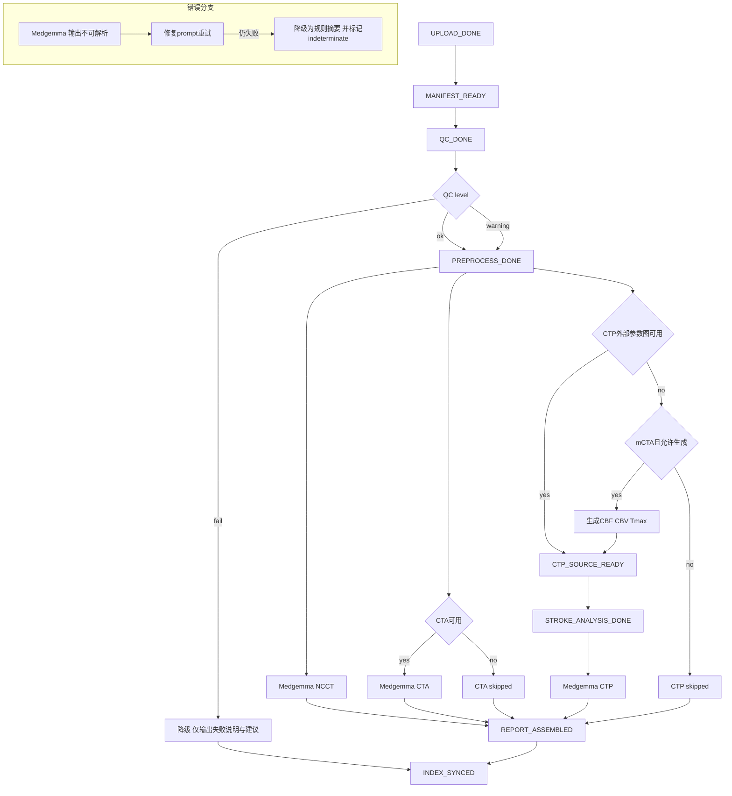

# 卒中智能体端到端方案定稿（可直接进入研发，兼容现有代码库，Medgemma 1.5 可插拔）

对齐既有系统核心能力与已产出文档：[`docs/CORE_FUNCTIONS.md`](docs/CORE_FUNCTIONS.md)、[`plans/STROKE_AGENT_PROPOSAL.md`](plans/STROKE_AGENT_PROPOSAL.md)、[`plans/STROKE_AGENT_RND_REQUIREMENTS.md`](plans/STROKE_AGENT_RND_REQUIREMENTS.md)。现有工程基线：Flask 后端（[`app.py`](app.py)）+ Web viewer/report（[`templates/patient/upload/viewer/index.html`](templates/patient/upload/viewer/index.html)、[`static/js/viewer.js`](static/js/viewer.js)）+ MRDPM/Palette 灌注图生成（[`ai_inference.py`](ai_inference.py)）+ 卒中分析（半暗带/核心/不匹配）（[`stroke_analysis.py`](stroke_analysis.py)）+ 报告保存与查看（[`api_save_report()`](app.py:1276)、[`report_page()`](app.py:1633)）。

本定稿目标：

1. 医生提交病例时录入基本信息并上传其拥有的影像数据。
2. 系统自动识别模态组合并自动编排推理与分析（不依赖医生手动点按钮）。
3. 影像智能解读：每个模态由 Medgemma 1.5 独立分析、独立产出该模态结构化结果与报告段落；随后汇总器拼装急诊卒中总报告，并可追溯各模态证据。
4. 卒中量化分析：无论 CTP 参数图来自 MRDPM 生成还是医生上传，均自动触发并复用现有卒中分析能力（半暗带、核心梗死、不匹配）并产出叠加图与量化指标，作为报告证据。
5. RAG 对话：新增“医生输入 patient_id 即可对话”，系统自动读取该病例报告与结构化结论，脱敏后用于对话回答。
6. 可插拔模型：当前统一使用 Medgemma 1.5；未来替换自训模型不改上层编排、协议、前端展示。

---

## 1. 端到端流程（从提交到对话）

### 1.1 医生提交（患者信息 + 文件上传）

1) 医生填写患者信息（姓名、年龄、性别、发病时间、NIHSS 等）→ 写入 Supabase（既有接口可复用，见 [`insert_patient_info()`](app.py:30)、[`api_insert_patient()`](app.py:1022)）。

2) 医生上传影像（NCCT 必选，其它可选）：

- 组合 A：仅 NCCT
- 组合 B：NCCT + 单期 CTA
- 组合 C：NCCT + mCTA（三期）
- 组合 D：NCCT + CTA + CTP（CTP 参数图输入）

上传入口复用现有：[`upload_files()`](app.py:2803)（当前前端强制 4 件套，需最小侵入式改造为 NCCT 必选、其余可选；上传页模板与脚本见 [`templates/patient/upload/index.html`](templates/patient/upload/index.html)、[`processFiles()`](static/js/upload.js:72)）。

### 1.2 模态识别与任务自动编排（无需手动点击）

上传成功后，系统立即创建并运行一次“编排任务 Orchestration Job”（同步 P0 / 异步 P1）：

- 生成 `case_manifest.json`
- 识别 `available_modalities`
- QC gate（ok/warning/fail）
- 按模态触发：NCCT 分析、CTA/mCTA 分析、CTP 分析、卒中量化（必需证据）、汇总报告
- 落盘与索引 → viewer 自动展示

### 1.3 每模态独立分析（Medgemma 1.5）

- NCCT 模块：出血排除 / 早期缺血征象 / ASPECTS 倾向（强调不确定性与复核）
- CTA/mCTA 模块：LVO 部位、侧支评分（mCTA 强、单期 CTA 有限）
- CTP 模块：核心/半暗带/不匹配、DEFUSE3/DAWN 风格量化提示（以“提示”而非自动治疗决策）

每个模块均输出：结构化 JSON + 模态段落 Markdown（可编辑）+ 证据索引。

### 1.4 卒中量化与可视化证据（复用现有能力，自动触发）

触发条件：

- 若医生上传了 CTP 参数图（CBF/CBV/Tmax 等）：直接进入“卒中量化分析”
- 若未上传参数图但存在 mCTA 且允许系统生成：复用灌注生成链路（[`class MultiModelAISystem`](ai_inference.py:22)）生成 CBF/CBV/Tmax 后进入量化

量化算法复用现有：[`class StrokeAnalysis`](stroke_analysis.py:16)、[`analyze_stroke_case()`](stroke_analysis.py:374)。

产物复用现有 viewer 展示机制：

- 伪彩图：[`generate_all_pseudocolors_route()`](app.py:895)
- 卒中叠加图读取：[`get_stroke_analysis_image()`](app.py:1006)

### 1.5 汇总报告（多模态急诊总报告）

汇总器将各模态段落与“卒中量化证据”拼装为一份总报告：

- 报告必须标注来源模态与证据索引（如切片编号、叠加图路径、量化指标来源）
- 报告可编辑，编辑后保存为 Final，并可回写 Supabase（复用 [`api_save_report()`](app.py:1276)）

### 1.6 RAG 对话（医生输入 patient_id 即可问诊）

新增能力：医生在对话页直接输入 `patient_id`，系统自动读取该病例最新“总报告 + 结构化结果 + 关键证据摘要”，脱敏后进入 RAG 检索与回答。

现有对话入口参考：[`chat_page()`](app.py:1321)、[`api_chat_clinical_stream()`](app.py:1443)、[`api_chat_clinical()`](app.py:1562)。

新增：基于 patient_id 的读取、脱敏、索引与审计（详见第 7 节）。

---

## 2. 输入组合识别与自动分流策略（NCCT 必选 + 降级路径）

### 2.1 模态枚举（available_modalities）

- `ncct`
- `cta_single`
- `mcta`
- `ctp_maps_external`（医生上传的参数图）
- `perfusion_generated`（系统生成的 CBF/CBV/Tmax 可用）

### 2.2 分流规则

1) 只要存在 NCCT：始终运行 NCCT 模块（Medgemma）。

2) 若存在 `cta_single` 或 `mcta`：运行 CTA/mCTA 模块（Medgemma）。

3) CTP 模块的来源优先级：

- 优先：`ctp_maps_external`
- 否则：若 `mcta` 且允许生成 → 运行灌注生成（复用 [`class MultiModelAISystem`](ai_inference.py:22)）→ 标记 `perfusion_generated`
- 否则：CTP 模块 `skipped`

4) 卒中量化分析（半暗带/核心/不匹配）触发：

- 若存在 `ctp_maps_external` 或 `perfusion_generated` → 必跑量化与叠加图
- 否则跳过，并在报告中输出缺失解释与建议补采

### 2.3 QC gate 与降级

QC 结果分级：`ok | warning | fail`。

- `fail`：所有模态模块状态置为 `failed` 或 `skipped`，仅输出“质量差/缺失提示报告”，并提示人工复核或重新上传
- `warning`：允许输出，但结论默认 `indeterminate` 或降低 `confidence`，并强制写入不确定性原因与建议

---

## 3. 系统编排：阶段划分、触发条件、状态机

### 3.1 Stage 定义（控制流）

- `UPLOAD_DONE`
- `MANIFEST_READY`
- `QC_DONE`
- `PREPROCESS_DONE`
- `CTP_SOURCE_READY`
- `STROKE_ANALYSIS_DONE`
- `MEDGEMMA_NCCT_DONE`
- `MEDGEMMA_CTA_DONE`
- `MEDGEMMA_CTP_DONE`
- `REPORT_ASSEMBLED`
- `INDEX_SYNCED`

### 3.2 Mermaid 编排图（含错误分支）



---

## 4. 后端模块划分与接口契约（路由/API/字段/错误码/可观测性）

### 4.1 最小侵入式改造原则（与现有系统复用）

复用不动：

- 上传、viewer、现有图像读取路由（[`upload_files()`](app.py:2803)、[`viewer_page()`](app.py:2798)、[`get_image()`](app.py:2934)）
- 灌注图生成（[`class MultiModelAISystem`](ai_inference.py:22)）
- 卒中分析量化与可视化（[`analyze_stroke_case()`](stroke_analysis.py:374)、[`get_stroke_analysis_image()`](app.py:1006)）
- 报告保存（[`api_save_report()`](app.py:1276)）
- 既有对话接口（[`api_chat_clinical_stream()`](app.py:1443)、[`api_chat_clinical()`](app.py:1562)）

新增为主：

- Orchestrator（编排器）API：`/api/agent/*`
- 产物目录规范与 `case_manifest`
- 三个模态 Medgemma 独立分析模块（NCCT/CTA/CTP）
- 汇总报告拼装器
- patient_id 直读的 RAG 对话入口与脱敏

需要轻改：

- 上传页允许可选模态 + 上传后自动触发编排
- viewer 动态卡片展示（基于落盘 JSON 与证据索引）

### 4.2 唯一标识策略

- `patient_id`：来自 Supabase（既有逻辑）
- `file_id`：一次上传生成的病例文件集 ID（现有逻辑已存在并用于 viewer 查询）
- `job_id`：一次编排运行的任务 ID（新增）

约束：一个 `file_id` 可运行多次 job（不同参数、不同模型版本），但 viewer 默认展示最新 `job_id`。

### 4.3 API 定义（字段级）

#### 4.3.1 `POST /api/agent/run`

请求体：

```json
{
  "patient_id": 123,
  "file_id": "F20260215_0001",
  "idempotency_key": "uuid-...",
  "options": {
    "auto_run": true,
    "allow_generate_perfusion": true,
    "prefer_external_ctp": true,
    "generate_pseudocolor": true,
    "timeout_seconds": 900
  },
  "audit": {
    "operator": "doctor|system",
    "trace_id": "uuid-...",
    "request_ip": "...",
    "user_agent": "..."
  }
}
```

响应体：

```json
{
  "success": true,
  "job_id": "JOB_20260215_001",
  "file_id": "F20260215_0001",
  "stage": "QC_DONE",
  "poll": "/api/agent/status?file_id=F20260215_0001&job_id=JOB_20260215_001"
}
```

幂等：`file_id + idempotency_key`。

#### 4.3.2 `GET /api/agent/status`

响应体：

```json
{
  "success": true,
  "job_id": "JOB_...",
  "file_id": "...",
  "stage": "REPORT_ASSEMBLED",
  "modules": {
    "ncct": "done|running|skipped|failed",
    "cta": "done|running|skipped|failed",
    "ctp": "done|running|skipped|failed",
    "stroke": "done|running|skipped|failed",
    "report": "done|running|failed"
  },
  "progress": {"percent": 80},
  "last_error": {"code": "", "message": ""}
}
```

#### 4.3.3 `GET /api/agent/result`

响应体（返回索引，避免大文件）：

```json
{
  "success": true,
  "job_id": "JOB_...",
  "file_id": "...",
  "paths": {
    "case_manifest": "static/processed/<file_id>/case_manifest.json",
    "ncct": "static/processed/<file_id>/module_results/ncct_v1.json",
    "cta": "static/processed/<file_id>/module_results/cta_v1.json",
    "ctp": "static/processed/<file_id>/module_results/ctp_v1.json",
    "stroke": "static/processed/<file_id>/module_results/stroke_v1.json",
    "report_draft": "static/processed/<file_id>/report/report_draft_v1.md",
    "report_final": "static/processed/<file_id>/report/report_final_v1.md"
  }
}
```

#### 4.3.4 错误码（统一）

- `ERR_CASE_NOT_FOUND`
- `ERR_INPUT_MISSING_NCCT`
- `ERR_QC_FAIL`
- `ERR_MEDGEMMA_PARSE`
- `ERR_PERFUSION_GENERATION`
- `ERR_STROKE_ANALYSIS`
- `ERR_REPORT_ASSEMBLY`
- `ERR_DB_SYNC`

### 4.4 可观测性与审计

每个 job 必须落盘：

- `audit/job_v1.json`：入参、版本、trace_id、耗时
- `audit/errors.jsonl`：错误事件流
- `audit/metrics.json`：模块耗时、重试次数

---

## 5. 结构化 JSON Schema（模块结果 + 汇总）

### 5.1 case_manifest.json（必须字段）

```json
{
  "schema_version": "1.0.0",
  "patient_id": 123,
  "file_id": "F...",
  "job_id": "JOB...",
  "created_at_utc": "...",
  "available_modalities": ["ncct", "mcta"],
  "inputs": [{"role": "ncct", "path": "inputs/ncct.nii.gz", "sha256": "..."}],
  "qc": {"level": "ok|warning|fail", "warnings": [], "fatal": []},
  "modules": {
    "ncct": {"state": "done|skipped|failed", "result": "module_results/ncct_v1.json"},
    "cta": {"state": "done|skipped|failed", "result": "module_results/cta_v1.json"},
    "ctp": {"state": "done|skipped|failed", "result": "module_results/ctp_v1.json"},
    "stroke": {"state": "done|skipped|failed", "result": "module_results/stroke_v1.json"},
    "report": {"state": "done|failed", "draft": "report/report_draft_v1.md", "final": "report/report_final_v1.md"}
  }
}
```

### 5.2 模态模块结果（ncct/cta/ctp）统一 envelope

沿用“证据→结论→不确定性/建议”结构，字段必须包含：

- `schema_version`、`module`、`patient_id`、`file_id`、`job_id`、`timestamp_utc`
- `qc`
- `evidence[]`：至少 1 条
- `findings[]`：至少 2 条（NCCT）、至少 1 条（CTA/CTP）
- `model.engine=medgemma-1.5`（当前阶段固定）
- `status.state`

### 5.3 卒中量化模块结果（stroke_v1.json）

要求输出：

- `core_volume_ml`、`penumbra_volume_ml`、`mismatch_ratio`
- `thresholds`（例如 Tmax>6s、rCBF<30% 等；若当前系统以 Tmax 阈值实现，也需明确 basis）
- `visuals.overlays[]`（半暗带/核心/综合）

实现复用：[`class StrokeAnalysis`](stroke_analysis.py:16) 与相关路由（[`analyze_stroke()`](app.py:955)）。

---

## 6. Medgemma 1.5 调用方式与按模态拆分策略（输入组织/提示词/输出解析/自愈）

### 6.1 统一输入组织：Evidence Pack（不直接喂 NIfTI）

每模态生成 evidence pack：

- `patient_context`：年龄、NIHSS、发病到入院时间（可选）
- `qc_summary`
- `key_images[]`：1~6 张关键切片 PNG（文件路径或 base64，视部署）
- `rule_metrics`：规则提取的数值（例如核心/半暗带体积）
- `constraints`：严格 JSON 输出要求、枚举范围、单位要求

### 6.2 Prompt 版本化（可替换模型的关键）

每模态维护独立 prompt id + prompt version，例如：

- `medgemma.ncct.v1`
- `medgemma.cta.v1`
- `medgemma.ctp.v1`

结果 JSON 内必须记录 `model.prompt_id`、`model.prompt_version`、`model.engine`。

### 6.3 模态边界（必须不同）

#### 6.3.1 NCCT（关注重点）

- 输出重点：出血排除、早期缺血征象、ASPECTS 倾向（可 indeterminate）
- 禁止：基于 NCCT 给出具体血管闭塞部位结论

#### 6.3.2 CTA/mCTA（关注重点）

- 输出重点：LVO 部位（ICA-T/M1/M2/BA 等）、侧支评分（mCTA）
- 单期 CTA：必须输出 `limited_by_modality=true` 并提高不确定性

#### 6.3.3 CTP（关注重点）

- 输出重点：核心/半暗带/不匹配、DEFUSE3/DAWN 风格量化提示
- 量化指标必须来自卒中量化模块（规则/算法）；Medgemma 只做语言化与结构化归因

### 6.4 输出解析与自愈

1) 严格 JSON parse
2) schema validate（缺字段、枚举、数值范围）
3) repair prompt 重试 2 次
4) 仍失败：降级为“规则摘要 + indeterminate”，记录 `ERR_MEDGEMMA_PARSE`

---

## 7. RAG 对话（patient_id 直读、脱敏、索引/向量化、权限与审计、失败兜底）

### 7.1 数据读取路径（按优先级）

给定 `patient_id`：

1) 从 Supabase 读取患者信息与最新报告索引（既有读取能力参考 [`get_patient_by_id()`](app.py:73)、[`api_get_patient()`](app.py:1251)）。

2) 从病例 `file_id` 对应落盘目录读取：

- `report/report_final_v1.md`（优先）
- `report/report_draft_v1.md`
- `module_results/*.json`（ncct/cta/ctp/stroke/fusion）
- `case_manifest.json`

3) 若 Supabase 缺失或落盘缺失：返回兜底提示并给出继续路径（见 7.6）。

### 7.2 脱敏规则（最小要求 + 可扩展）

必须脱敏字段：

- 姓名：替换为 `患者` 或 `Pxxxx`
- 手机/身份证/住址：规则正则打码
- 精确时间：可保留相对时间（发病至入院小时数），去除具体日期

脱敏策略：

- 在对话前，先对“报告文本 + 结构化 JSON”进行脱敏转换，生成 `rag_context_sanitized.json`
- 原文仅保存在受控目录，访问需审计

### 7.3 索引/向量化策略（建议）

索引对象：

- 报告分段（NCCT/CTA/CTP/结论建议/证据索引）
- 结构化 findings（按 category、conclusion、uncertainty）

向量化：

- chunk 粒度：每段 200~400 中文字符 + metadata（patient_id/file_id/job_id/module）
- 触发：每次报告 final 更新后增量索引

### 7.4 权限控制与审计

- 权限：至少基于登录 session 或 API token，按 `patient_id` 授权
- 审计：每次对话必须记录 `who/when/patient_id/trace_id/retrieved_docs_hash`

### 7.5 新增对话接口（字段级）

新增（推荐与现有 clinical chat 并存）：

- `POST /api/chat/clinical/by_patient`
- `POST /api/chat/clinical/by_patient/stream`

请求体：

```json
{
  "patient_id": 123,
  "question": "...",
  "options": {"use_rag": true, "sanitize": true},
  "audit": {"trace_id": "...", "operator": "doctor"}
}
```

响应体：

```json
{
  "success": true,
  "answer": "...",
  "sources": [{"type": "report", "path": "report/report_final_v1.md", "section": "CTP"}],
  "sanitized": true
}
```

### 7.6 失败兜底策略（必须可继续）

- 病例不存在：`ERR_CASE_NOT_FOUND`，提示去创建/上传，并给出跳转链接
- 报告未生成：提示“正在处理/尚未生成”，提供 `poll_url` 或建议稍后重试
- 模态缺失：回答时明确“依据不足”，并从 manifest 生成“建议补充 CTA/CTP”

---

## 8. 前端与 viewer 动态展示：信息架构 + 状态机 + 缺失文案

### 8.1 信息架构（建议在现有 viewer 上最小扩展）

对齐现有 viewer 网格（NCCT/CTA 多期 + CBF/CBV/Tmax + Stroke Analysis）见 [`templates/patient/upload/viewer/index.html`](templates/patient/upload/viewer/index.html)。新增一块“智能体结果栏”：

- 顶部状态条：上传中/处理中/完成/失败/部分完成/等待补充
- 模态卡片：NCCT 卡、CTA 卡、CTP 卡、卒中量化卡、冲突/需复核卡
- 每卡片统一展示：结论（中文）、不确定性原因、证据缩略图、下一步建议

### 8.2 前端状态机

- `uploading`
- `processing`
- `completed`
- `failed`
- `partial_completed`
- `waiting_more_modalities`

状态来源：轮询 `GET /api/agent/status`。

### 8.3 缺失模态解释文案（生成规则）

由 `case_manifest.available_modalities` 与各模块 `state` 自动生成：

- 缺 CTA：未上传 CTA 或 mCTA，系统未执行血管闭塞与侧支评估。建议补充 CTA/mCTA。
- 缺 CTP：未提供 CTP 参数图且当前条件无法生成可靠灌注量化，核心/半暗带/不匹配不输出。建议补充 CTP。
- QC warning：影像质量存在风险，自动结论需人工复核。

---

## 9. 产物目录与命名规范（研发落地约束）

病例根目录：`static/processed/<file_id>/`（与现有 processed 目录一致）。

必须存在：

- `case_manifest.json`
- `module_results/`（每个模块一个 v1 json）
- `report/`（draft + final）
- `audit/`（job + errors + metrics）

建议布局（与上一版设计一致）：

```text
static/processed/<file_id>/
  inputs/
  preprocess/
  perfusion/
  visuals/
  module_results/
  report/
  audit/
```

---

## 10. 验收标准与测试计划（覆盖四组合 + 自动触发 + 可追溯 + RAG + 前端动态 + 失败可用）

### 10.1 测试用例矩阵

1) NCCT-only：

- 自动触发 NCCT 模块 + 报告拼装
- 结果卡显示 NCCT 结论与证据
- CTP/CTA 卡显示缺失文案与建议

2) NCCT + 单期 CTA：

- 自动触发 NCCT + CTA 模块
- CTA 模块必须标注能力受限

3) NCCT + mCTA：

- 自动触发 NCCT + CTA/mCTA
- 若允许生成灌注：自动生成 CBF/CBV/Tmax + 卒中量化 + CTP 模块

4) NCCT + CTA + CTP 参数图：

- 自动触发 NCCT + CTA + 卒中量化 + CTP 模块
- 报告必须引用核心/半暗带/不匹配指标并注明来源

### 10.2 自动触发与幂等

- 上传完成后无需手点按钮，系统自动创建 job 并进入 processing
- 重复触发同一 `idempotency_key` 不重复跑，复用结果

### 10.3 报告分段与可追溯

- 报告必须按模态分段，且每段给出证据路径/切片索引
- 结构化 JSON 中 evidence 必须能映射到实际文件

### 10.4 RAG patient_id 直读与脱敏

- 输入 patient_id 即可提问
- answer 返回 sources
- 姓名等标识符在 context 与 answer 中均脱敏

### 10.5 失败与部分完成可用

- 任一模块失败：报告仍生成（标注缺失/失败原因码），viewer 可继续浏览已有影像

---

## 11. 示例输出（医生可直接使用）

> 注意：示例仅展示格式与可追溯写法；数值为示例值。

### 11.1 示例 A：NCCT-only

结构化 JSON 摘要（精简版）：

```json
{
  "schema_version": "1.0.0",
  "module": "ncct",
  "patient_id": 101,
  "file_id": "F20260215_0001",
  "job_id": "JOB_20260215_001",
  "qc": {"level": "ok", "warnings": []},
  "evidence": [
    {"type": "image", "title": "NCCT关键切片", "path": "visuals/key_slices/ncct_key_slice_012.png", "slice_index": 12}
  ],
  "findings": [
    {
      "id": "F001",
      "category": "hemorrhage",
      "conclusion": "negative",
      "confidence": {"value": 0.72, "calibration": "hybrid"},
      "uncertainty": {"level": "medium", "reasons": [{"code": "UNC_LIMITED_EVIDENCE", "message": "仅基于NCCT自动分析"}]},
      "recommendations": [{"type": "manual_review", "message": "建议放射科医生复核"}],
      "structured": {"hemorrhage_ruleout": "negative"}
    },
    {
      "id": "F002",
      "category": "ischemia",
      "conclusion": "indeterminate",
      "confidence": {"value": 0.45, "calibration": "model"},
      "uncertainty": {"level": "high", "reasons": [{"code": "UNC_EARLY_CHANGE", "message": "早期缺血征象不典型"}]},
      "recommendations": [{"type": "acquire_cta", "message": "建议补充CTA评估大血管"}, {"type": "acquire_ctp", "message": "建议补充CTP进行量化"}],
      "structured": {"aspects_estimate": "indeterminate", "early_ischemic_signs": "indeterminate"}
    }
  ],
  "model": {"engine": "medgemma-1.5", "prompt_id": "medgemma.ncct.v1", "prompt_version": "1.0"},
  "status": {"state": "done"}
}
```

可编辑文本报告（总报告，按模态分段，引用证据）：

```md
## 检查方法
头颅CT平扫 NCCT。

## NCCT影像表现  来源:NCCT
- 结论: 未见明确颅内出血征象 可信度中等。
- 早期缺血征象: 未见典型表现或不典型 不确定性高。
- 证据: visuals/key_slices/ncct_key_slice_012.png。
- 建议: 建议放射科医生复核；如临床高度怀疑卒中，建议补充CTA评估大血管闭塞，必要时补充CTP量化评估。

## 血管评估  来源:缺失
未上传CTA或mCTA，血管闭塞与侧支评估未执行。

## 灌注与量化  来源:缺失
未提供CTP参数图且当前条件无法生成可靠灌注量化，核心/半暗带/不匹配不输出。

## 总结与建议
本报告为自动辅助生成，结论需结合临床与人工阅片复核。
```

### 11.2 示例 B：NCCT + CTA + CTP 参数图

结构化 JSON 摘要（汇总版，精简）：

```json
{
  "schema_version": "1.0.0",
  "patient_id": 202,
  "file_id": "F20260215_0009",
  "job_id": "JOB_20260215_009",
  "available_modalities": ["ncct", "cta_single", "ctp_maps_external"],
  "stroke_metrics": {
    "core_volume_ml": 18.4,
    "penumbra_volume_ml": 62.1,
    "mismatch_ratio": 3.37,
    "basis": {"penumbra": "tmax>6s", "core": "rcbf<30%"}
  },
  "key_findings": {
    "ncct": {"hemorrhage_ruleout": "negative", "aspects_estimate": 8},
    "cta": {"lvo_suspect": "positive", "occlusion_site": "M1", "collateral": "limited"},
    "ctp": {"defuse3_hint": "eligible_hint"}
  },
  "evidence": {
    "ncct": ["visuals/key_slices/ncct_key_slice_020.png"],
    "cta": ["visuals/key_slices/cta_key_slice_033.png"],
    "ctp_overlays": [
      "visuals/overlays/slice_033_core_overlay.png",
      "visuals/overlays/slice_033_penumbra_overlay.png",
      "visuals/overlays/slice_033_combined_overlay.png"
    ]
  }
}
```

可编辑文本报告（总报告，按模态分段，引用证据与量化指标并标注来源）：

```md
## 检查方法
头颅CT平扫 NCCT + 头颈CTA 单期 + CTP参数图。

## NCCT影像表现  来源:NCCT
- 出血: 未见明确颅内出血征象。
- 早期缺血: 左侧大脑中动脉供血区可疑早期缺血改变。
- ASPECTS: 8 分 依据:自动辅助评估 需人工复核。
- 证据: visuals/key_slices/ncct_key_slice_020.png。

## 血管评估  来源:CTA
- LVO提示: 阳性。
- 闭塞部位: M1段闭塞可能。
- 侧支: 单期CTA能力受限 结果不确定性中高。
- 证据: visuals/key_slices/cta_key_slice_033.png。

## 灌注与量化  来源:CTP参数图 + 卒中量化模块
- 核心梗死体积: 18.4 ml 依据: rCBF<30%。
- 半暗带体积: 62.1 ml 依据: Tmax>6s。
- 不匹配比: 3.37。
- DEFUSE3提示: 满足倾向 仅作提示。
- 证据叠加: visuals/overlays/slice_033_core_overlay.png, visuals/overlays/slice_033_penumbra_overlay.png, visuals/overlays/slice_033_combined_overlay.png。

## 结论与建议
- 影像学考虑急性缺血性卒中可能。
- 建议结合NIHSS与发病至入院时间窗，完善卒中团队评估；关键结论需人工阅片复核。
```

---

## 12. 是否建议用 Dify 辅助搭建智能体

结论：建议“局部使用”，不建议把“影像模态识别→任务编排→产物落盘→viewer对接→卒中量化”这条强工程链路完全放到 Dify。

### 12.1 Dify 适合辅助的部分

1) RAG 对话层：

- 文档分段、向量化、检索、引用来源展示
- 多版本 prompt 管理、A/B 测试
- 审计与对话日志归档（仍需对接院内合规要求）

2) 报告语言化增强：

- 将结构化结论生成“更可读的段落”
- 作为可替换的大模型编排层（不影响底层量化与证据）

### 12.2 Dify 不适合主导的部分

- NIfTI/影像处理与配准
- 灌注生成（MRDPM/Palette）与卒中量化（阈值、连通域、体积）
- 与现有 Flask viewer 的强对接（路径、切片 API、产物缓存）

### 12.3 若不使用 Dify，推荐的搭建方式

- 影像与量化：继续在 Flask/Python 侧实现（复用 [`ai_inference.py`](ai_inference.py)、[`stroke_analysis.py`](stroke_analysis.py)）
- LLM：通过“模型适配层”封装 Medgemma 与未来自训模型，业务层只消费结构化 JSON
- RAG：自建轻量向量索引（本地或 Supabase/pgvector），严格控制脱敏、权限与审计

