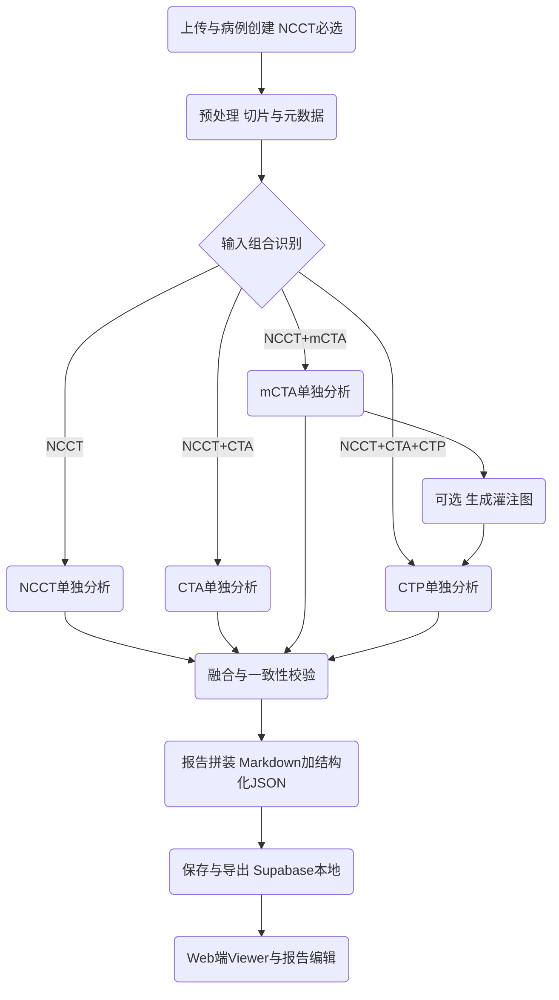

# 卒中智能体建设方案（面向 NCCT 必选、多模态可选的落地路径）

> 背景：现有系统已具备影像上传与预处理、mCTA/NCCT 灌注图生成与伪彩展示、Tmax 病灶分析、半暗带/核心梗死/不匹配评估、AI 诊断报告生成、影像查看与交互式报告等能力（见 [`docs/CORE_FUNCTIONS.md`](../docs/CORE_FUNCTIONS.md)）。导师建议新增三条“单独分析”能力：NCCT 单独分析、mCTA/CTA 单独分析、CT 灌注单独分析，并与现有 Web 端融合。

---

## 1）目标临床场景与核心价值

### 1.1 目标临床场景（急诊卒中一线）

- 场景 S1：仅有 NCCT（必选）
  - 急诊初筛：排除出血、评估早期缺血征象、粗分层风险与是否需进一步 CTA/CTP。
- 场景 S2：NCCT + 单期 CTA（single-phase）
  - 快速判断：大血管闭塞（LVO）疑似部位、血管显影、颈内动脉/大脑中动脉段等关键血管通畅性提示。
- 场景 S3：NCCT + mCTA（三期 CTA）
  - 侧支与动态灌注信息更充分：更可靠的 LVO + 侧支循环分级；必要时进入 MRDPM/Palette 的灌注图生成与后续量化。
- 场景 S4：NCCT + CTA + CTP（CT 灌注参数图或可生成）
  - 治疗决策支持：核心/半暗带/不匹配、DEFUSE 3 条件提示、可解释证据链（图像叠加 + 数值 + 规则结论）。

### 1.2 核心价值主张（产品经理视角）

1. 减少急诊影像判读与汇总时间：把“多模态影像 → 量化 → 结构化结论 → 报告段落”自动化。
2. 降低漏诊与不一致风险：用规则引擎 + 质量控制（QC）提醒数据缺失、伪影、配准/方向异常。
3. 强化可解释性：每条结论对应证据（关键切片编号、叠加图、阈值依据、模型置信度/质量标志）。
4. 形成可迭代的智能体框架：NCCT/CTA/CTP 各自可独立上线，也可融合输出“总报告”。

---

## 2）新增功能的能力边界与输出

> 原则：每个“单独分析”模块都能在缺少其他模态时独立给出结构化输出；多模态时由融合层进行一致性校验与报告拼装。

### 2.1 NCCT 单独分析模块（必选）

**输入边界**

- 必须：NCCT NIfTI（或等价体数据）。
- 可选：患者基本信息（年龄、NIHSS、发病到入院时间）用于报告语义化。

**输出边界（结构化 + 可视化 + 报告段落）**

- 结构化 JSON（建议字段示例）
  - `hemorrhage_ruleout`: 是否提示出血（是/否/不确定）+ 证据切片
  - `aspects_estimate`: ASPECTS 估计（可先做规则/半自动，后续升级模型）
  - `early_ischemic_signs`: 早期缺血征象（岛叶带消失、灰白质界限等）
  - `hyperdense_mca_sign`: 高密度 MCA 征
  - `qc`: 扫描质量、伪影、方向/强度异常提示
- 可视化产物
  - 关键切片的叠加图或标注截图（例如疑似出血区域/缺血区域的 heatmap）。
- 报告段落
  - NCCT 检查方法 + 影像表现 + 初步结论（强调不替代医生）。

**与现有系统的对齐点**

- 现有上传链路与病例目录组织可复用（主编排仍在 [`app.py`](../app.py)）。

### 2.2 CTA / mCTA 单独分析模块

**输入边界**

- single-phase CTA：仅动脉期 CTA 或单期 CTA 体数据。
- mCTA：动脉/静脉/延迟期三期 CTA 体数据（与现有上传页一致）。

**输出边界**

- 结构化 JSON
  - `lvo_suspect`: LVO 疑似（是/否/不确定）
  - `occlusion_site`: 责任血管/闭塞段（如 ICA-T、M1、M2、BA 等）
  - `collateral_score`: 侧支分级（mCTA 更适配；single-phase 给出受限版本）
  - `arch_to_intracranial_notes`: 从颈部到颅内关键血管的通畅性摘要（先做规则化描述，后续模型化）
  - `qc`: 配准、显影不足、注射时相不佳等提示
- 可视化
  - 最大密度投影（MIP）/关键层面截图 + 闭塞疑似标注
- 报告段落
  - 血管评估段落（与现有报告模板风格一致）

**与现有系统的对齐点**

- 现有 viewer 已有 CTA 三格展示区（NCCT/动脉/静脉/延迟）在 [`templates/patient/upload/viewer/index.html`](../templates/patient/upload/viewer/index.html) 与 [`static/js/viewer.js`](../static/js/viewer.js)。新增 CTA-only 时仅点亮已有格子并显示缺失提示。

### 2.3 CT 灌注 CTP 单独分析模块（参数图驱动）

**输入边界**

- 方式 1：直接输入 CTP 参数图（CBF/CBV/Tmax 等）。
- 方式 2：无参数图时，若具备 NCCT + mCTA，可调用现有灌注图生成链路（现有多模型推理入口可复用 [`class MultiModelAISystem`](../ai_inference.py:22) 或现有 MRDPM 流程）。

**输出边界**

- 结构化 JSON
  - `core_volume_ml`、`penumbra_volume_ml`、`mismatch_ratio`
  - `defuse3_eligibility_hint`: 满足与否/不确定（作为提示，不作为最终治疗结论）
  - `lesion_masks`: 核心/半暗带掩码索引与关键切片
  - `qc`: 参数图范围异常、噪声、缺失切片提示
- 可视化
  - 伪彩参数图（可复用 [`app.route('/generate_pseudocolor/<file_id>/<int:slice_index>')`](../app.py:863) 与 [`app.route('/generate_all_pseudocolors/<file_id>')`](../app.py:894)）
  - 半暗带/核心叠加图（可复用现有 [`class StrokeAnalysis`](../stroke_analysis.py:16) 的可视化输出）
- 报告段落
  - 灌注结论段：核心/半暗带位置与体积、不匹配意义、注意事项

---

## 3）与现有模块的融合流程与数据流

### 3.1 统一编排：Stroke Agent Orchestrator

新增一个“智能体编排层”负责：

- 自动识别输入组合：NCCT-only / NCCT+CTA / NCCT+mCTA / NCCT+CTA+CTP
- 触发对应的单独分析模块
- 结果融合：一致性校验、冲突标注、报告段落拼装
- 输出统一格式：`case_summary.json` + `report.md` + `evidence/` 目录

**落地建议（与当前后端兼容）**

- 继续以 [`app.py`](../app.py) 为编排入口（现有上传、viewer、报告、分析路由集中）。
- 新增统一 API（示意）：
  - `POST /api/agent/run`：上传完成后触发“按可用数据运行”
  - `GET /api/agent/status?file_id=...`：状态查询
  - `GET /api/agent/result?file_id=...`：获取结构化输出与报告片段

### 3.2 数据落盘与目录约定

复用当前处理产物路径风格（现有使用 `static/processed/<file_id>/...` 的思路，详见 [`analyze_stroke_case()`](../stroke_analysis.py:374)）。建议新增：

```text
static/processed/<file_id>/
  inputs/                       原始输入索引与元数据
  qc/                           质量控制结果
  ncct/                         NCCT 单独分析产物
  cta/                          CTA 或 mCTA 单独分析产物
  ctp/                          灌注参数图与量化分析产物
  fusion/                       融合输出与冲突标注
  report/                       拼装后的报告与结构化 JSON
```

### 3.3 数据流（Mermaid）



---

## 4）用户体验与工作流（从上传到报告）

### 4.1 一句话体验目标

“NCCT 必选，其他模态可选；上传后系统自动跑完可用链路，在 viewer 中以证据卡片展示关键发现，并一键生成可编辑报告。”

### 4.2 Web 端工作流（对齐现有页面结构）

1. 病例创建与患者信息
   - 沿用现有患者信息流程与 Supabase 存储逻辑（集中在 [`app.py`](../app.py) 的患者接口部分）。
2. 上传页
   - 将现有“4 文件必填”改为“NCCT 必填，CTA/CTP 可选”。
   - 上传完成后返回 `available_modalities` 与 `next_recommended_step`。
   - 现有上传入口在 [`app.route('/upload')`](../app.py:2802)；前端逻辑在 [`static/js/upload.js`](../static/js/upload.js)。
3. Viewer 展示
   - 保留现有 4+3+分析格子布局（NCCT、CTA 多期、CBF/CBV/Tmax、Stroke analysis）。
   - 根据可用模态点亮对应格子；缺失模态显示灰态占位，并给出“缺失导致的能力边界提示”。
   - viewer 页面在 [`app.route('/viewer')`](../app.py:2797)、模板在 [`templates/patient/upload/viewer/index.html`](../templates/patient/upload/viewer/index.html)，交互在 [`static/js/viewer.js`](../static/js/viewer.js)。
4. 报告
   - “快速预报告”：自动拼装 NCCT/CTA/CTP 段落 + 风险提示。
   - “可编辑正式报告”：进入现有报告页能力（现有入口在 [`app.route('/report/<int:patient_id>')`](../app.py:1632)）。
   - 报告生成可复用现有百川调用逻辑（如 [`generate_report_with_baichuan()`](../app.py:217) 与报告 API 路由段）。

### 4.3 缺失与异常的 UX 规则

- 缺失模态：清晰写明“未上传 CTA/CTP，相关结论不输出或仅输出不确定提示”。
- QC 异常：把“质量不佳”作为一级提示（例如显影不足、运动伪影、配准失败），并降低模型/规则结论的确定性。
- 冲突处理：例如 NCCT 提示大面积缺血但 CTP 核心体积很小 → 输出“需人工复核”与证据卡。

---

## 5）关键 AI / 算法 / 规则模块（可落地拆分）

> 设计为“模型能力 + 规则引擎 + 一致性校验”的组合，避免把临床结论完全押注单一模型。

### 5.1 NCCT 模块

- 出血排除：规则优先（高密度阈值 + 形态学 + 解剖先验），后续可引入分割/分类模型。
- ASPECTS：优先做半自动/规则版 MVP（区域划分 + 低密度征象评分），后续替换为深度学习评分。
- 早期缺血征：灰白质对比度、岛叶带等规则提示 + 可解释热图。

### 5.2 CTA / mCTA 模块

- LVO 提示：先做血管显影与对侧差异规则（MIP/中心线强度），后续引入血管分割 + 闭塞分类模型。
- 侧支评分：mCTA 三期动态信息更适配，可先做“相对显影分级规则”，后续引入学习型评分。

### 5.3 CTP 模块

- 核心/半暗带：基于阈值与后处理（现有已有阈值化与连通域清理思路可参考 [`class StrokeAnalysis`](../stroke_analysis.py:16)）。
- DEFUSE 3 提示：规则引擎输出 `eligibility_hint`，并要求展示体积、比值、阈值依据。
- MRDPM 生成参数图：在 NCCT+mCTA 场景下可复用现有多模型推理框架（如 [`class MultiModelAISystem`](../ai_inference.py:22)）。

### 5.4 融合与一致性校验模块（智能体核心）

- 多模态一致性：
  - 侧别一致性（左/右）
  - LVO 部位与灌注缺损区域一致性
  - NCCT 大面积缺血与 CTP 核心体积逻辑一致性
- 风险分层规则：结合 NIHSS、年龄、发病至入院时间等临床变量（现有报告 prompt 已覆盖这些变量约束）。

---

## 6）合规、可解释性与临床验证要点

### 6.1 合规与风险控制

- 定位：辅助决策支持（CDSS），不替代医生诊断。
- 数据与权限：患者信息与报告落库需审计；敏感信息脱敏；保留访问日志。
- 模型输出约束：
  - 任何“治疗建议”必须以提示形式呈现，并展示依据与不确定性。
  - 对缺失模态与 QC 不佳强制降级输出。

### 6.2 可解释性

- 每条核心结论需配套：
  - 证据切片（slice 索引）
  - 叠加图/热图
  - 阈值或评分规则
  - 质量标记与不确定性

### 6.3 临床验证（从可做的路径出发）

- 回顾性验证：
  - 与放射科/卒中中心共识结论对照（出血、LVO、侧支、核心/半暗带）
  - 指标：敏感性/特异性、体积误差、评分一致性（kappa/ICC）
- 前瞻性试用：
  - 先做“并行不影响临床决策”的暗运行
  - 记录人机差异、复核反馈、失败样本归因（QC/模型/规则）。

---

## 7）阶段性里程碑与优先级（强调实施路径，不含工时）

### P0：MVP 必须交付（先能用、能闭环）

1. 上传改造：NCCT 必选，其余可选；返回 `available_modalities` 与 `qc_summary`。
2. NCCT 单独分析 MVP：出血排除 + 早期缺血征提示 + QC + 报告段落。
3. CTP 单独分析 MVP：若有参数图则直接量化与可视化；若无则在 NCCT+mCTA 下走现有生成链路。
4. Viewer 融合展示：缺失模态灰态 + 证据卡 + 一键生成预报告。

### P1：增强决策支持（提高临床价值）

1. CTA/mCTA 单独分析 MVP：LVO 疑似 + 闭塞段提示 +（mCTA）侧支分级。
2. 融合一致性校验：侧别、部位、体积逻辑冲突提示。
3. 报告拼装器：模块化段落 + 可编辑总报告 + 保存与导出。

### P2：规模化与验证（从能用到可信）

1. 模型化升级：ASPECTS 学习型评分、血管分割、侧支学习型评分。
2. 合规与审计完善：权限、日志、脱敏、版本可追溯。
3. 临床验证体系：回顾性指标看板、前瞻性试用 SOP、失败样本闭环。

---

## 8）与现有系统的直接复用清单（减少改造成本）

- 后端路由与编排中心：[`app.py`](../app.py)
  - 上传入口：[`app.route('/upload')`](../app.py:2802)
  - viewer 入口：[`app.route('/viewer')`](../app.py:2797)
  - 伪彩生成：[`app.route('/generate_all_pseudocolors/<file_id>')`](../app.py:894)
  - 卒中分析：[`app.route('/analyze_stroke/<file_id>')`](../app.py:954)
- AI 推理框架：[`ai_inference.py`](../ai_inference.py)
  - 多模型管理：[`class MultiModelAISystem`](../ai_inference.py:22)
- 病灶分析与可视化：[`stroke_analysis.py`](../stroke_analysis.py)
  - 核心类：[`class StrokeAnalysis`](../stroke_analysis.py:16)
- Web viewer 与交互：[`templates/patient/upload/viewer/index.html`](../templates/patient/upload/viewer/index.html)、[`static/js/viewer.js`](../static/js/viewer.js)

